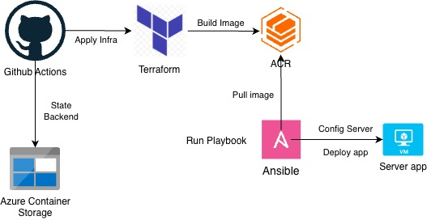
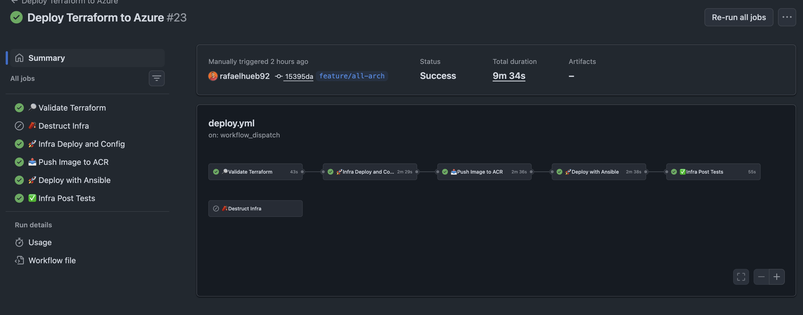
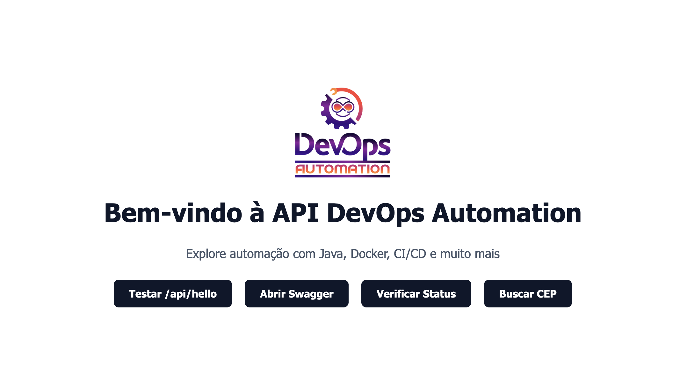

# ☁️ Azure + Terraform + Ansible + GitHub Actions 🚀

This project is a **study repository** based on the Udemy course by **Ieso Dias**.  
**Goal:** Master the integration of Azure, Terraform, Ansible, and GitHub Actions in a modern CI/CD pipeline.

---

### 🛠️ Initial Setup (The "Run First" Step)

Before triggering the pipeline, you must prepare the Azure environment. We use a bootstrap script to create the Terraform Backend and the Service Principal.

1. **Make it executable:**
   `chmod +x run-first.sh`
2. **Execute it:**
   `./run-first.sh`

**What happens?**

- 📦 Creates a Resource Group and Storage Account for the **Terraform State**.
- 🔐 Generates a **Service Principal** (JSON) for GitHub authentication.
- 📋 **Action Required:** Copy the resulting JSON into your GitHub Secrets!

---

### 🔑 GitHub Secrets Configuration

To make the magic happen, configure these secrets in your repo:

- `AZURE_CREDENTIALS`: 📄 The JSON output from the script.
- `ARM_SUBSCRIPTION_ID`: 🆔 Your Azure Subscription ID.
- `ADMIN_PASSWORD`: 🔑 Password for VM access and Ansible sudo tasks.

---

### ⚙️ The Workflow (CI/CD)

This repo uses `workflow_dispatch`, meaning you have total control from the GitHub Actions UI:

- **Branch Selection:** 🌿 Choose which branch to deploy.
- **Destroy Toggle:** 🧨 A dropdown to choose between `false` (Deploy) or `true` (Destroy).

#### 🔄 Pipeline Flow:

1. **Terraform:** 🏗️ Validate -> Plan -> Apply.
2. **App:** ☕ Build Java -> 🐳 Dockerize -> 🛡️ Trivy Scan -> 📤 Push to ACR.
3. **Ansible:** 🤖 Configure VM -> 🚀 Deploy Container.
4. **QA:** ✅ Smoke tests on Swagger & Azure CLI status checks.

---

### 🖼️ Architecture & Results

#### 🏗️ Infrastructure Diagram

#### 📸 Execution Screenshot

#### 📸 Execution Screenshot

---

### 💡 Improvements to do

- Separate workflow in files
- Get the image from ACR not from Ieso's Docker Hub Repo
